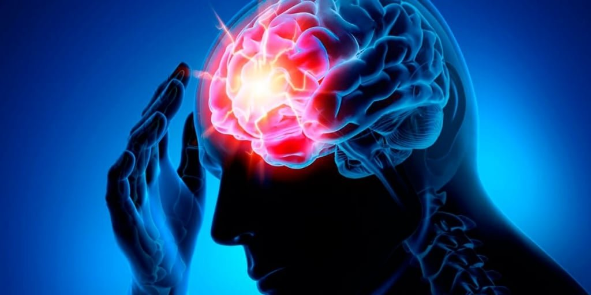
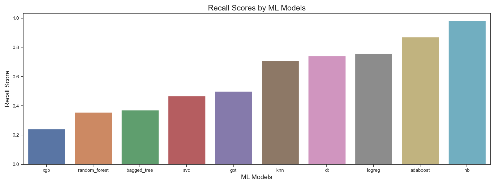

# Stroke Prediction Analysis
Authors: Volha Puzikava
***

## Overview
Every 40 seconds, someone in the United States has a stroke. Every 3.5 minutes, someone dies of stroke. Every year, more than 795,000 people in the United States have a stroke. According to the World Health Organization (WHO), stroke is the 2nd leading cause of death globally, responsible for approximately 11% of total deaths. Moreover, stroke is a leading cause of serious long-term disability.

This project tends to predict whether a patient is more likely to get a stroke during their lifetime and thus, helps to reduce stroke occurence and prevent the illness before it happens. 
***

## Business Problem
The World Health Organization asked to analyze the stroke dataset and provide information about what parameters likely increase the occurence of stroke in people, so the people with the higher chance of getting stroke can be monitored more often in order to prevent the illness before it strikes. The main purpose of the analysis was to build different machine learning algorithms and choose the one that has the highest performance rate predicting the stroke occurence.
***

## Data Understanding
The data for the analysis was taken from [kaggle website](https://www.kaggle.com/datasets/fedesoriano/stroke-prediction-dataset?select=healthcare-dataset-stroke-data.csv). The data provided 11 clinical features for predicting stroke effect: gender and age of the patients, their marital status, work type, residence type, smoking status, the precense of hypertension and heart disease, average glucose level and body mass index. The dataset contained information about 5,110 patients.
***

## Data Preparation and Exploration
The first step was to check how imbalanced the dataset was. Since the column "stroke" served as the indicator of weather or not a patient had a stroke, the distribution of values in that column was calculated. It turned out that the dataset was imbalanced: 95% of people did not have a stroke, while only 5% had. 

The dataset was then checked for the presence of missing values. They were present only in "bmi" column and were replaced with the column's mean value.

The distribution of stroke occurence was then checked among the numerical features of the dataset. It was found out that the average age of people with stroke is around 67 years, those people are more likely to have hypertension and heart disease and their glucose level is much higher than in people without a stroke. Also, body mass index turned out to be not of a much influence. The pairplot was then used to visualize the relationship betweeen the variables.

The stroke incidences were also compared by gender, marital status, work type, residence type and smoking status. It turned out that people who are married, self-employed and formely smokers are more likely to develop stroke in their lifetime. Gender and residence type do not influence much on the occurence of the illness.

In order to be used in a model, all categorical variables ("gender", "ever_married", "Residence_type", "work_type" and "smoking_status") had to be transformed. The first three mentioned columns had the values replaced to numerical ones, while the remaining two columns used dummy variables.

It was also important to see if the predictive features would result in multicollinearity in the final model. With that in mind, pearson correlation coefficients of the predictive features were generated and visualized. According to the heatmap, the highest correlation belonged to "ever_married" and "age" (0.68). The most strongly correlated features with the target variable were "age", "hypertension", "heart_disease", "ever_married" and "avg_glucose_level".
***

## Data Modeling
In order to build any ML model, a train-test split should be performed. The prediction target for this analysis was the column "stroke", so the data was separated into a train set and test set accordingly. The "id" column was dropped since it represented a unique identifier, not an actual numeric feature.

The class imbalance in the training and test set was then found and SMOTE-NC class was used in order to improve the models' performance on the minority class. SMOTE-NC was applied because the dataset contained both categorical and numerical features.

Since the World Health Organization really cares about avoiding 'false negatives' more than avoiding 'false positives' (it is a crime to say that a person will not have a stroke, and then he/she will develop it, than predict that the person will have a stroke and he/she will not actually have it), higher recall score and lower number of false negatives were the metrics the ML models were evaluated upon. The model with the highest recall was chosen for the prediction.

Different machine learning algorithms were built in the following way:
- the baseline model was build and evaluated;
- one or more hyperparameters were tuned to find if the model could perform any better;
- the optimized model was run and checked for any improvements in the performance;
- the model with the highest recall score for each algorithm type was chosen for further analysis.

#### Logistic Regression Models
The logistic regression baseline model with default parameters had recall of 74%, meaning that if a person belongs to class 1 (having a stroke), there is about 74% chance that the model will correctly label this person as class 1. The number of false negatives was equal to 16. The accuracy of the model constituted 73%, meaning that the model correctly identifies if a person will have a stroke about 73% of the time.
The logistic regression tuned model (with hyperparameters of penalty='l2' and solver='liblinear') performed a little better: the recall score got higher (76%), while the number of false negatives got a little less (15). The logistic regression tuned model was chosen for future analysis.

#### Decision Tree Models
The decision tree baseline model had a recall of 34%, which was less than the logistic regression models. The number of false negatives got higher and became equal to 41. The model used all the features except "work_type_Never_worked" and "work_type_children" with the most important being "age", "bmi" and "avg_glucose_level". The model was then optimized to check if better recall could be achieved.
The decision tree tuned model (with the following hyperparameters: max_depth=4, min_samples_split=18, min_samples_leaf=9, max_features=13) performed much better than the baseline model. It showed the recall of 74% with false negatives being equal to 16. The model considered "age", "work_type_Private", "bmi" and "avg_glucose_level" as the most important features. The model was chosen for future analysis.

#### Bagged Trees Models
The bagged tree baseline model (n_estimators=100) didn't perform well enough. The recall score was equal to 34%, while the number of false negatives became 41. The model got to be tuned to perform better.
The bagged tree tuned model (with n_estimators=100 and max_features=2) didn't perform differently: the recall score stayed the same 34%, while the number of false negatives remained equal to 41. But because the accuracy score of the bagged tree tuned model was higher, the model was chosen for further analysis.

#### Random Forest Models
The random forest baseline model didn't perform well enough: it had a low recall score (32%) with the high number of false negatives (42). The model gave the strongest importance to "age", "avg_glucose_level" and "bmi" columns. The model was then tuned to find if it could perform any better.
The recall score of random forest tuned model (with the hyperparameter max_features=7) got a little better (35%), and the number of false negatives got a little bit lower (40). The model considered "age", "bmi", and "avg_glucose_level" as the most important features and didn't take into consideration "work_type_Never_worked". The random forest tuned model was chosen for further analysis.

#### AdaBoost Models
The adaboost baseline model had a recall of 61% and 24 false negative results. The model was optimized to check for better performance.
The adaboost tuned model (with the hyperparameter learning_rate=0.2) performed much better: recall score became equal to 87%, while the number of false negatives dropped to 8. The adaboost tuned model was chosen for further analysis.

#### Gradient Boosting Models
The performance of the gradient boosting baseline model was as follows: recall score constituted 50%, while the number of false negatives was equal to 31. The optimized model was then build and eveluated.
The gradient boosting tuned model (with the hyperparameter learning_rate=0.7) performed a little worse than the baseline model: the recall score dropped to 26%, while the false negatives increased to 46. The baseline model was chosen.

#### XGBoost Models
The XGBoost baseline model was not great: the recall got equal to only 19%. The model was optimized to check for higher performance.
The XGBoost tuned model (with the following hyperparameters: learning_rate=0.2, max_depth=6, min_child_weight=1, n_estimators=100, subsample=0.7) perfromed a little better: the recall became equal to only 24% now. The XGBoost tuned model was chosen.

#### Naive Bayes Models
The naive bayes baseline model perfromed better than any model before. It got recall score of 98% with false negatives being equal to only 1. The model was still optimized to see if it could perform better.
The performance of the naive bayes tuned model (with the hyperparameter var_smoothing=0.0123) got worse. The recall decreased to 85%, while the number of false negatives increased to 9. It meant that the default parameters were much better in prediction whether a person would develop a stroke. The baseline model was chosen for further analysis.

In order to build knn and svm models, one more step was needed: the data had to be normalized. That had to be done for two reasons: 
- to avoid information "leaking" from the test set into the training set;
- to avoid having a larger impact that larger scaled features have on the distance between the points in distance-based classifiers.

Normalization (AKA Standardization or Scaling) means making sure that all of the data is represented at the same scale. The most common way to do this is to convert all numerical values to z-scores.

#### KNN Models
The knn baseline model didn't perform well. The recall score was low and equal to 39%. The model was then optimized to find the best k value in order to increase the recall.
The knn tuned model (with n_neighbors=97) performed much better: the recall score increased to 71%, while the number of false negatives dropped to 18. The knn tuned model was chosen.

#### SVM Models
The svc baseline model had a recall of 47% and the number of false negatives was equal to 33. The model was optimized to check for the higer recall.
The svc tuned model (with C=10 and gamma=1) didn't perform any better: the recall score didn't change and was equal to 47%, but because the number of false negatives got more (55 compared to 33 in baseline model), the svc baseline model was chosen for further analysis.
***

### Model Evaluation
Based on the findings, the graph with the best recall scores was plotted. It was found out that the best recall score belonged to naive bayes baseline model. 

Based on the classification report of the model, it was determined that the model correctly identifies if a person will have a stroke about 37% of the time. Recall value of the model is 98%, meaning that if a person belongs to class 1 (having a stroke), there is about 98% chance that the model will correctly label this person as class 1. 

The model is classifying 68% of people as prone to stroke, even though fever than 5% of people are actually in that category. We do this in order to miss as few true positives as possible. This kind of model seems extreme, however, it is very useful for the stakeholders. The algorithm successfully identifies the people that are prone to stroke, so they can receive some kind of extra treatment or be monitored more often. The chosen model will allow to monitor 68% of the patients and successfully treat 98% of the ones that will develop stroke.

## Conclusions
The analysis of the stroke dataset resulted in the evaluation of different machine learning models that can help predict if the patients will develop stroke during their lifetime. The best model was found to be naive bayes baseline model, that had the highest recall of 98%. The chosen model correctly identifies if a person will have a stroke about 37% of the time and is able to determine 98% of the true positives (98% of the patients that will develop stroke). 

The mentioned model may seem extreme, since it classifies 68% of people as prone to stroke, while in reality fever than 5% of the patients will actually develop the illness. However, since the World Health Orgnization really cares about avoiding 'false negatives' more than avoiding 'false positives' (we have to get as fewer people as possible who, according to the model's predictions will not have a stroke, while in reality they will have), the models' performances were chosen based on the higher recall scores and lower number of false negatives. The naive bayes baseline model with recall of 98% is very useful for the stakeholder, since it successfully identifies the people that are prone to stroke. As a result these patients can receive some kind of extra treatment or be monitored more often.

Although, the model suggests the stakeholder to closely monitor the majority of the patients (68%) in order to successfully treat 98% of the ones that will develop stroke, it kills two birds with one stone:
- the model manages to decrease the death and disability rates caused by stroke;
- it promotes healthy lifestyle among the population (when people find out that they are prone to stroke, they start eating healthy, doing sports, monitoring blood pressure, etc.)

Thus, the naive bayes baseline model advices the World Health Organization and doctors to pay detailed attention to people who are over 45 years old, have hypertension and/or heart disease, high glucose level, who are married, self-employed and either smoke or formerly smoked, as their chances to develop stroke further in life are very high. 

We recommend to the World Health Organization to utilize the above described model only if there is a special kind of treatment or particular monitoring practices of blood, urine or other specimens developed only for those people who are prone to get stroke. If the stakeholder decides to change the direction of the research and, for example, to simply identifies what percentage of people will have a stroke in the future for the statistical purposes, the model has to be changed. The naive bayes model's accuracy is only 37%, which is fine only for this particular exercise. If the goal of the research changes, the model with a higher accuracy score should be chosen.

Also, to get more precise and accurate results for the prediciton of stoke occurences, more information may be needed. Thus, family history, alcohol consumption, kind of diet, the presence of diabetes, frequency of exercises, etc. by the patients are recommended to be included into the dataset.